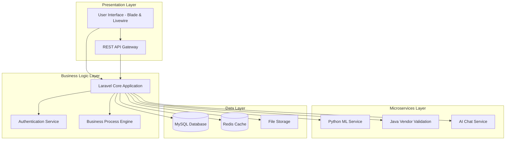
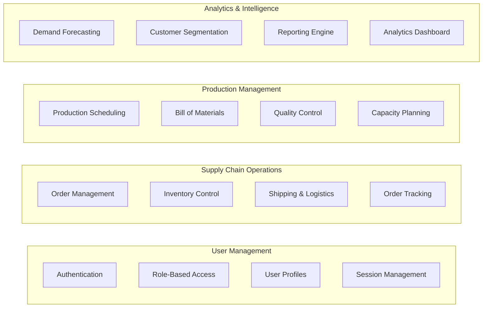
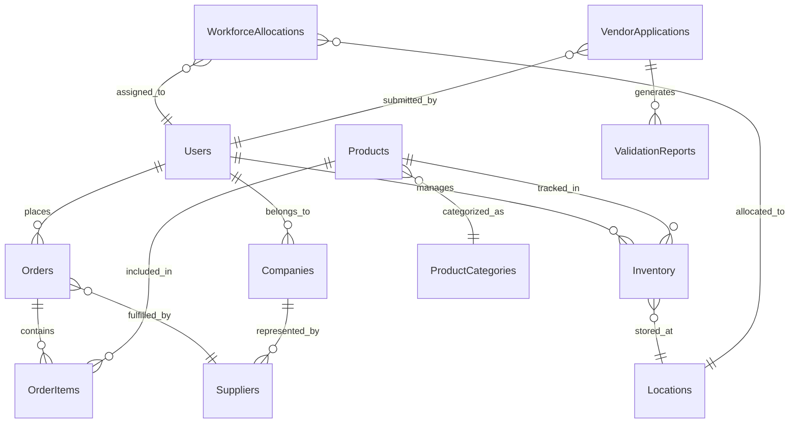
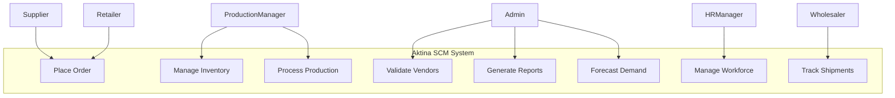
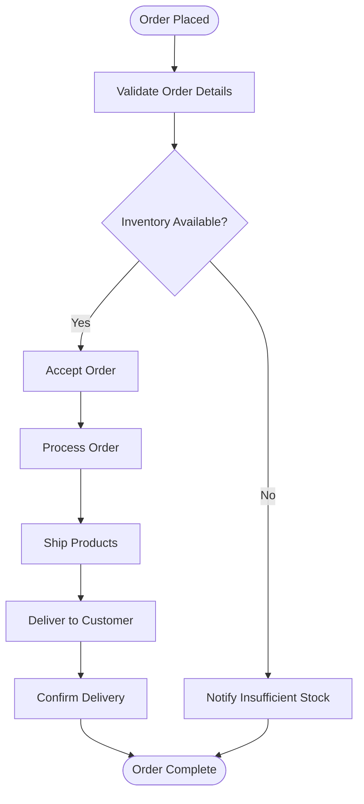

# Software Design Document for Aktina Supply Chain Management System

**Team G-28**  
**June 2024**  
**COLLEGE OF COMPUTING AND INFORMATION SCIENCES**

**Supervised by:** Mr. Brian Muchake

| Name | Registration Number | Student Number |
|------|-------------------|----------------|
| Student 1 | 23/XXXXX/EVE | 2300XXXXXX |
| Student 2 | 23/XXXXX/EVE | 2300XXXXXX |
| Student 3 | 23/XXXXX/EVE | 2300XXXXXX |
| Student 4 | 23/XXXXX/EVE | 2300XXXXXX |
| Student 5 | 23/XXXXX/EVE | 2300XXXXXX |

---

## Table of Contents

- [Software Design Document for Aktina Supply Chain Management System](#software-design-document-for-aktina-supply-chain-management-system)
  - [Table of Contents](#table-of-contents)
  - [1. INTRODUCTION](#1-introduction)
    - [1.1 Purpose](#11-purpose)
    - [1.2 Scope](#12-scope)
      - [1.2.1 Description](#121-description)
      - [1.2.2 Goals](#122-goals)
      - [1.2.3 Objectives](#123-objectives)
      - [1.2.4 Benefits](#124-benefits)
    - [1.3 Overview](#13-overview)
    - [1.4 Reference Material](#14-reference-material)
    - [1.5 Definitions and Acronyms](#15-definitions-and-acronyms)
  - [2. SYSTEM OVERVIEW](#2-system-overview)
    - [2.1 Functionalities](#21-functionalities)
    - [2.2 Context](#22-context)
    - [2.3 Design](#23-design)
  - [3. SYSTEM ARCHITECTURE](#3-system-architecture)
    - [3.1 Architectural Design](#31-architectural-design)
    - [3.2 Decomposition](#32-decomposition)
    - [3.3 Design Rationale](#33-design-rationale)
  - [4. DATA DESIGN](#4-data-design)
    - [4.1 Data Description](#41-data-description)
    - [4.2 Data Dictionary](#42-data-dictionary)
  - [5. COMPONENT DESIGN](#5-component-design)
    - [5.1 Core System Objects and Member Functions](#51-core-system-objects-and-member-functions)
  - [6. HUMAN INTERFACE DESIGN](#6-human-interface-design)
    - [6.1 Overview of User Interface](#61-overview-of-user-interface)
    - [6.2 Screen Images](#62-screen-images)
  - [7. REQUIREMENTS MATRIX](#7-requirements-matrix)
  - [8. APPENDICES](#8-appendices)
    - [Appendix A: Glossary](#appendix-a-glossary)
    - [Appendix B: System Requirements](#appendix-b-system-requirements)
    - [Appendix C: Database Schema](#appendix-c-database-schema)
    - [Appendix D: Use Case Diagrams](#appendix-d-use-case-diagrams)
    - [Appendix E: Activity Diagrams](#appendix-e-activity-diagrams)
    - [Appendix F: Contact Information](#appendix-f-contact-information)
    - [Appendix G: References](#appendix-g-references)

---

## 1. INTRODUCTION

### 1.1 Purpose

This Software Design Document (SDD) provides a comprehensive design specification for the Aktina Supply Chain Management System. The document serves as the primary reference for software developers, system architects, and stakeholders involved in the implementation and maintenance of the system. It translates the functional and non-functional requirements into a detailed technical blueprint that guides the development process.

The document establishes the architectural framework, data structures, component interfaces, and user interaction patterns necessary for building a robust supply chain management platform that serves Aktina's technology assembly operations.

### 1.2 Scope

#### 1.2.1 Description

The Aktina Supply Chain Management System is a comprehensive web-based platform designed to manage the complete supply chain lifecycle for Aktina, a technology assembly company specializing in consumer electronics. The system encompasses raw material procurement, production management, inventory control, order processing, workforce distribution, and retail distribution through an integrated digital platform.

The system supports six distinct user roles: Suppliers, Production Managers, HR Managers, System Administrators, Wholesalers/Vendors, and Retailers. Each role operates within a customized interface that provides role-specific functionality while maintaining data consistency and business process integrity across the entire supply chain.

#### 1.2.2 Goals

The primary goals of the Aktina Supply Chain Management System include:

- **Operational Efficiency**: Streamline supply chain operations from raw material sourcing to final product delivery, reducing manual processes and eliminating operational bottlenecks.

- **Predictive Intelligence**: Implement machine learning capabilities to forecast demand, optimize inventory levels, and provide data-driven recommendations for strategic decision-making.

- **Integration and Visibility**: Provide end-to-end visibility across all supply chain participants, enabling real-time tracking and coordinated decision-making.

- **Quality Assurance**: Establish automated vendor validation processes and quality control mechanisms to ensure supplier reliability and product standards.

- **Scalability and Flexibility**: Design a modular architecture that can adapt to changing business requirements and scale with organizational growth.

#### 1.2.3 Objectives

The specific objectives of the system implementation are:

- **Reduce Operational Costs**: Achieve a 20% reduction in inventory carrying costs and 10% reduction in overall supply chain operational expenses through optimization algorithms and automated processes.

- **Improve Response Times**: Decrease order fulfillment time by 15% through streamlined workflows and real-time coordination between supply chain participants.

- **Enhance Forecast Accuracy**: Implement machine learning models to achieve 25% improvement in demand forecast accuracy, reducing stockouts and overstock situations.

- **Automate Vendor Management**: Establish a Java-based automated vendor validation system that reduces vendor onboarding time by 30% while maintaining quality standards.

- **Facilitate Communication**: Provide role-based communication channels and AI-powered chatbot support to improve collaboration and reduce response times.

#### 1.2.4 Benefits

The implementation of the Aktina Supply Chain Management System will deliver the following benefits:

- **Operational Benefits**: Improved process efficiency, reduced manual errors, enhanced coordination between supply chain participants, and real-time visibility into operations.

- **Financial Benefits**: Cost reduction through optimized inventory management, improved supplier negotiations, and reduced operational overhead.

- **Strategic Benefits**: Data-driven decision-making capabilities, predictive analytics for market trends, and enhanced competitive positioning in the technology assembly market.

- **Technological Benefits**: Modern, scalable architecture that supports future growth, integration capabilities with external systems, and robust security framework.

- **User Experience Benefits**: Intuitive interfaces tailored to specific roles, automated workflows that reduce manual tasks, and comprehensive reporting capabilities.

### 1.3 Overview

### 1.3 Overview

This Software Design Document is organized into eight main sections, providing comprehensive technical specifications for the Aktina Supply Chain Management System:

**1. Introduction** (pages 1-5): Establishes the purpose, scope, and context of the system, including goals, objectives, and benefits of implementation.

**2. System Overview** (pages 6-10): Describes the core functionalities, business context, and overall design philosophy of the supply chain management platform.

**3. System Architecture** (pages 11-18): Details the architectural design, system decomposition, and design rationale, including diagrams of the hybrid architecture approach.

**4. Data Design** (pages 19-26): Specifies data structures, relationships, and the database schema that supports the system's functionality.

**5. Component Design** (pages 27-35): Outlines core system objects, member functions, and interactions between components with pseudocode examples.

**6. Human Interface Design** (pages 36-45): Illustrates the user interface design for each role, including dashboard layouts and screen images.

**7. Requirements Matrix** (pages 46-48): Maps functional and non-functional requirements to specific system components and verification methods.

**8. Appendices** (pages 49-60): Provides supplementary materials including glossary, system requirements, database schema, and reference diagrams.

The document serves as the primary technical reference for developers implementing the system and stakeholders evaluating the design approach.


### 1.4 Reference Material
### 1.4 Reference Material

The design and development of this system reference the following standards and documentation:

[1] IEEE Standards Association, "IEEE Standard for Information Technology—Systems Design—Software Design Descriptions," IEEE Std 1016-2009, July 2009. [Online]. Available: https://standards.ieee.org/ieee/1016/5254/

[2] IEEE Standards Association, "IEEE Recommended Practice for Software Requirements Specifications," IEEE Std 830-1998, Oct. 1998. [Online]. Available: https://standards.ieee.org/ieee/830/2481/

[3] Taylor Otwell, "Laravel Documentation," Laravel.com, 2023. [Online]. Available: https://laravel.com/docs/10.x

[4] R. T. Fielding, "Architectural Styles and the Design of Network-based Software Architectures," University of California, Irvine, 2000. [Online]. Available: https://www.ics.uci.edu/~fielding/pubs/dissertation/top.htm

[5] S. Newman, "Building Microservices: Designing Fine-Grained Systems," O'Reilly Media, Feb. 2021. [Online]. Available: https://www.oreilly.com/library/view/building-microservices-2nd/9781492034018/

[6] D. Sculley et al., "Hidden Technical Debt in Machine Learning Systems," Google, Inc., 2015. [Online]. Available: https://proceedings.neurips.cc/paper_files/paper/2015/file/86df7dcfd896fcaf2674f757a2463eba-Paper.pdf

[7] S. Chopra and P. Meindl, "Supply Chain Management: Strategy, Planning, and Operation," Pearson, 2022. [Online]. Available: https://www.pearson.com/en-us/subject-catalog/p/supply-chain-management-strategy-planning-and-operation/P200000003037

[8] Redis Ltd., "Redis Documentation," Redis.io, 2023. [Online]. Available: https://redis.io/documentation

[9] Vue.js, "Vue.js 3 Documentation," Vuejs.org, 2023. [Online]. Available: https://vuejs.org/guide/introduction.html

### 1.5 Definitions and Acronyms

**Table 1: Definitions**

| Term | Definition |
|------|------------|
| Supply Chain Management (SCM) | The management of the flow of goods and services from raw materials to final products |
| Bill of Materials (BOM) | A comprehensive list of raw materials, components, and assemblies required to manufacture a product |
| Machine Learning (ML) | A subset of artificial intelligence that enables systems to learn and improve from experience |
| Vendor Validation | The process of verifying supplier credentials, financial stability, and compliance requirements |
| Event-Driven Architecture | A software architecture pattern where system components communicate through events |
| Role-Based Access Control (RBAC) | A security model that restricts system access based on user roles and permissions |

**Table 2: Acronyms**

| Acronym | Definition |
|---------|------------|
| API | Application Programming Interface |
| CRUD | Create, Read, Update, Delete |
| HTTP | Hypertext Transfer Protocol |
| JSON | JavaScript Object Notation |
| JWT | JSON Web Token |
| MVC | Model-View-Controller |
| ORM | Object-Relational Mapping |
| PDF | Portable Document Format |
| REST | Representational State Transfer |
| SDD | Software Design Document |
| SQL | Structured Query Language |
| UI | User Interface |
| UX | User Experience |
| XML | Extensible Markup Language |

---

## 2. SYSTEM OVERVIEW

### 2.1 Functionalities

The Aktina Supply Chain Management System provides comprehensive functionality across six core operational domains, each designed to support specific aspects of the supply chain workflow while maintaining integration and data consistency throughout the platform.

**Supply Chain Operations Management** encompasses end-to-end order processing from initial placement through final delivery confirmation. The system manages complex workflows involving multiple stakeholders, tracking order status through predefined stages including placement, acceptance, processing, shipment, and delivery confirmation. Inventory management capabilities provide real-time visibility into stock levels across multiple locations, automated reorder point calculations, and low-stock alerts to prevent disruptions.

**Production Management and Planning** provides comprehensive tools for manufacturing oversight, including production line scheduling, capacity planning, and resource allocation. The system manages Bill of Materials (BOM) creation and versioning, quality control checkpoints, and integration with workforce management to ensure optimal production efficiency.

**Machine Learning and Predictive Analytics** delivers intelligent insights through demand forecasting algorithms that analyze historical sales data, seasonal trends, and market conditions. Customer segmentation capabilities categorize purchasing patterns to support personalized recommendations and targeted marketing strategies. The system includes predictive models for stock-out risk assessment, production bottleneck identification, and lead time optimization.

**Vendor and Supplier Management** provides automated vendor validation through a dedicated Java microservice that processes application documents, evaluates financial stability, and assesses regulatory compliance. The system maintains comprehensive supplier performance metrics and supports collaborative communication channels between Aktina and its supplier network.

**Workforce Distribution and Management** optimizes human resource allocation across multiple supply centers through skills-based assignment algorithms and workload balancing mechanisms. The system provides performance tracking, productivity analytics, and capacity planning tools to support strategic workforce decisions.

**Communication and Collaboration Framework** implements role-based communication channels that enable secure messaging between authorized parties. An AI-powered chatbot provides automated support for common queries, while comprehensive reporting capabilities deliver stakeholder-specific insights on scheduled intervals.

### 2.2 Context

The Aktina Supply Chain Management System operates within the context of a technology assembly company that specializes in consumer electronics manufacturing, particularly smartphones and related devices. Aktina's business model centers on outsourcing component procurement and assembly operations, requiring sophisticated coordination between multiple external suppliers, internal production facilities, and downstream distribution partners.

**Business Environment** The system must accommodate the dynamic nature of the technology industry, where product lifecycles are short, component specifications change rapidly, and market demand fluctuates significantly. The platform serves as the central nervous system for Aktina's operations, coordinating activities across geographically distributed supply centers and managing relationships with a diverse network of suppliers and distributors.

**Stakeholder Ecosystem** The system supports six distinct user categories, each representing different organizational roles and external partnerships. Internal stakeholders include Production Managers who oversee manufacturing operations, HR Managers who coordinate workforce distribution, and System Administrators who maintain overall platform oversight. External stakeholders include Suppliers who provide raw materials and components, Wholesalers who distribute finished products, and Retailers who represent the final point of sale.

**Operational Context** The platform must support high-volume transaction processing, real-time data synchronization, and concurrent access by multiple users across different time zones. The system operates in a 24/7 environment where supply chain disruptions can have immediate financial impact, requiring robust error handling, comprehensive monitoring, and reliable backup systems.

**Integration Requirements** The system must interface with external logistics providers, financial systems, regulatory compliance databases, and market intelligence services. These integrations require secure API connections, data transformation capabilities, and error recovery mechanisms to ensure seamless information flow.

### 2.3 Design

The system design employs a hybrid architectural approach that combines proven architectural patterns to achieve scalability, maintainability, and performance objectives. This design philosophy emphasizes modularity, loose coupling, and clear separation of concerns while maintaining the integration necessary for effective supply chain management.

**Architectural Foundation** The core architecture implements a layered approach with distinct presentation, business logic, and data access layers. This foundation is enhanced with microservices patterns for specialized functions such as machine learning analytics and vendor validation, enabling independent development, deployment, and scaling of these components.

**Event-Driven Communication** Inter-component communication utilizes event-driven patterns to ensure loose coupling and support asynchronous processing. This approach enables the system to handle high-volume transactions while maintaining responsiveness and supporting eventual consistency across distributed components.

**Data Architecture** The system employs a centralized data architecture with MySQL as the primary transactional database, supplemented by Redis for caching and session management. Data consistency is maintained through carefully designed transaction boundaries and event sourcing for critical business processes.

**Security Framework** Security is implemented through multiple layers including role-based access control at the application level, encrypted communications using HTTPS/TLS, and comprehensive audit logging for compliance and forensic analysis. Authentication utilizes JWT tokens for stateless session management, while authorization is enforced through granular permission systems.

**User Experience Design** The user interface design emphasizes role-specific customization while maintaining consistency in navigation patterns and visual design. Each user role receives a tailored dashboard with relevant metrics, streamlined workflows for common tasks, and contextual access to detailed information.

---

## 3. SYSTEM ARCHITECTURE

### 3.1 Architectural Design

The Aktina Supply Chain Management System implements a hybrid architectural approach that strategically combines layered architecture, microservices, and event-driven patterns to create a robust, scalable, and maintainable platform suitable for complex supply chain operations.

**Core Architectural Principles** The system architecture is founded on principles of modularity, scalability, and separation of concerns. The primary Laravel application serves as the orchestration layer, managing user interactions, business logic, and data persistence while coordinating with specialized microservices for computationally intensive operations such as machine learning analytics and document processing.



**Service Architecture** The microservices layer provides specialized functionality that complements the core Laravel application. The Python machine learning service handles predictive analytics, demand forecasting, and customer segmentation using scikit-learn and pandas libraries. The Java vendor validation service processes PDF documents, performs financial analysis, and manages compliance verification workflows. The AI chat service provides natural language processing capabilities for automated customer support.

**Frontend Architecture** The presentation layer leverages Laravel Blade templating engine combined with Livewire for dynamic, reactive user interfaces without requiring complex JavaScript frameworks. This server-first approach provides seamless real-time updates, simplified state management, and progressive enhancement while maintaining tight integration with Laravel's backend capabilities. Livewire components enable modular UI development with efficient DOM updates and minimal client-server round trips.

**Integration Framework** Service communication occurs through well-defined REST APIs with JSON message formats, ensuring platform independence and facilitating future service replacements or upgrades. Event-driven messaging using message queues enables asynchronous processing for non-critical operations, improving system responsiveness and enabling horizontal scaling.

**Data Architecture** The data architecture employs a centralized approach with MySQL serving as the primary transactional database, ensuring ACID compliance for critical business operations. Redis provides high-performance caching for frequently accessed data and manages user sessions. File storage handles document uploads, reports, and media assets with appropriate backup and versioning mechanisms.

### 3.2 Decomposition

The system decomposition follows domain-driven design principles, organizing functionality into cohesive modules that align with business processes and user roles. This decomposition enables independent development, testing, and deployment while maintaining clear interfaces between system components.

**User Management Module** handles authentication, authorization, and user profile management across all six user roles. This module implements role-based access control (RBAC) with granular permissions, supporting both internal Aktina users and external partners with appropriate security boundaries.



**Supply Chain Operations Module** manages the core business processes including order placement, acceptance, processing, and fulfillment tracking. This module implements the order lifecycle state machine with appropriate transitions and validation rules, ensuring data consistency and business rule enforcement.

**Production Management Module** provides comprehensive manufacturing oversight including production line scheduling, Bill of Materials management, and quality control integration. This module coordinates with the workforce management system to optimize resource allocation and production efficiency.

**Analytics and Intelligence Module** implements machine learning capabilities for demand prediction, customer segmentation, and business intelligence reporting. This module interfaces with the Python microservice to execute complex analytical algorithms while maintaining responsive user interactions.

**Communication Module** provides secure messaging capabilities between authorized users, integrates with the AI chatbot service, and manages notification delivery across multiple channels including email, SMS, and in-application alerts.

**Vendor Management Module** coordinates with the Java validation service to automate supplier onboarding, maintain vendor performance metrics, and manage compliance documentation with appropriate approval workflows.

### 3.3 Design Rationale

The architectural design decisions reflect careful consideration of functional requirements, performance objectives, scalability needs, and maintenance considerations specific to supply chain management operations.

**Hybrid Architecture Selection** The combination of monolithic and microservices patterns provides an optimal balance between development simplicity and operational flexibility. The Laravel monolith handles standard CRUD operations and user interactions efficiently, while microservices address specialized requirements that benefit from independent scaling and technology selection.

**Technology Stack Rationale** Laravel was selected for the core application due to its mature ecosystem, robust ORM capabilities, and excellent support for rapid development with built-in security features. Python microservices leverage the rich machine learning ecosystem including scikit-learn, pandas, and numpy for advanced analytics. Java services provide enterprise-grade document processing and integration capabilities.

**Database Design Approach** MySQL was chosen for its proven reliability in transactional environments, strong consistency guarantees, and comprehensive tooling support. Redis complements MySQL by providing high-performance caching and session storage, reducing database load and improving response times for frequently accessed data.

**Security Architecture** The multi-layered security approach addresses the diverse security requirements of supply chain operations, including protection of sensitive business data, secure partner communications, and compliance with industry regulations. JWT-based authentication provides stateless session management suitable for distributed operations.

**Event-Driven Integration** Asynchronous messaging patterns support the complex workflows inherent in supply chain operations, where multiple stakeholders must coordinate activities across different time zones and operational schedules. This approach provides resilience against temporary service outages and enables eventual consistency across distributed components.

**User Interface Strategy** The role-based interface design recognizes that different user types have distinct information needs and workflow patterns. Customized dashboards improve user productivity by presenting relevant information prominently while maintaining consistent navigation patterns across roles.

---

## 4. DATA DESIGN

### 4.1 Data Description

The data architecture for the Aktina Supply Chain Management System employs a comprehensive relational database design that supports complex business relationships while maintaining data integrity and performance. The design accommodates the multi-tenant nature of the platform, where different user roles access overlapping but distinct data sets with appropriate security controls.

**Core Entity Relationships** The database schema centers around fundamental business entities including Users, Products, Orders, Suppliers, and Inventory. These core entities form the foundation for more specialized entities such as ProductionLines, WorkforceAllocations, and AnalyticsReports. Each entity maintains appropriate foreign key relationships to ensure referential integrity while supporting the complex workflows required for supply chain management.

**Temporal Data Management** Many entities incorporate temporal aspects to track historical changes and support audit requirements. Order entities maintain status transition timestamps, inventory entities track stock movement history, and user entities log activity patterns for analytics purposes. This temporal design enables comprehensive reporting and supports machine learning algorithms that depend on historical data patterns.

**Data Partitioning Strategy** Large transactional tables implement partitioning strategies based on temporal and geographical dimensions. Order data is partitioned by month to optimize query performance, while inventory data is partitioned by supply center location to support distributed operations. This partitioning approach ensures scalable performance as data volumes grow.

**Data Security and Privacy** Sensitive data elements implement field-level encryption where required, particularly for financial information and personal identifiable information (PII). The schema includes appropriate audit trails for all data modifications, supporting compliance requirements and forensic analysis capabilities.

**Analytics and Machine Learning Support** The data model incorporates specialized entities and attributes designed to support advanced analytics and machine learning capabilities. Historical transaction data, behavioral patterns, and performance metrics are captured with appropriate timestamps to enable time-series analysis. Feature-rich entities include predefined attributes for common ML algorithms, while maintaining extensibility through JSON-based feature stores for rapid model evolution.

#### Entity Overview

The Aktina SCM system relies on the following core entities:

1. **Users** - System users across all six roles with authentication and profile information
2. **UserRoles** - Role definitions with associated permissions for the RBAC system
3. **Companies** - Organization records for suppliers, wholesalers, and retailers
4. **Products** - Finished goods and raw materials managed within the supply chain
5. **ProductCategories** - Hierarchical categorization of products
6. **Orders** - Transaction records between supply chain participants
7. **OrderItems** - Line items within orders with quantity and pricing information
8. **Inventory** - Stock level tracking across multiple locations
9. **InventoryMovements** - Historical record of all inventory changes
10. **Locations** - Supply centers, warehouses, and retail locations
11. **Suppliers** - Extended supplier information with validation and performance data
12. **ProductionLines** - Manufacturing lines with capacity and capability attributes
13. **ProductionSchedules** - Temporal allocation of resources to production tasks
14. **BillOfMaterials** - Component specifications for product assembly
15. **WorkforceAllocations** - Staff assignments to locations and production lines
16. **VendorApplications** - Supplier onboarding documentation and validation process
17. **ValidationReports** - Automated vendor validation results and scoring
18. **QualityControls** - Quality checkpoints and test results throughout production
19. **ShipmentTracking** - Logistics tracking for orders in transit
20. **DemandForecasts** - Predictive models for future product demand
21. **CustomerSegments** - Classification of customer behaviors and preferences
22. **AnalyticsReports** - Predefined reporting templates and historical results
23. **MLModels** - Machine learning model metadata and performance metrics
24. **FeatureData** - Extracted and transformed data features for ML applications
25. **AuditLogs** - System-wide activity tracking for compliance and security
26. **Notifications** - User alerts and communications with delivery tracking

### 4.2 Data Dictionary

The following tables describe the core database entities, their attributes, data types, constraints, and relationships within the Aktina Supply Chain Management System.

**Table 1: Users**

| Field Name | Data Type | Size | Constraint | Description |
|------------|-----------|------|------------|-------------|
| user_id | VARCHAR | 36 | Primary Key, Not Null | Unique identifier for system users (UUID format) |
| email | VARCHAR | 255 | Unique, Not Null, Valid Email | User's email address for authentication |
| password_hash | VARCHAR | 255 | Not Null | Encrypted password using bcrypt algorithm |
| role_id | VARCHAR | 20 | Foreign Key, Not Null | References UserRoles table for RBAC |
| first_name | VARCHAR | 50 | Not Null | User's first name |
| last_name | VARCHAR | 50 | Not Null | User's last name |
| phone_number | VARCHAR | 20 | Null | Contact phone number |
| company_id | VARCHAR | 36 | Foreign Key, Null | References Companies table for external users |
| status | ENUM | - | Not Null | Values: 'active', 'inactive', 'pending', 'suspended' |
| profile_image | VARCHAR | 255 | Null | Path to user's profile image |
| language_preference | VARCHAR | 10 | Not Null, Default 'en-US' | Preferred language code |
| timezone | VARCHAR | 50 | Not Null, Default 'UTC' | User's timezone for date/time display |
| login_count | INT | - | Not Null, Default 0 | Total number of successful logins |
| access_pattern | JSON | - | Null | Behavioral pattern data for security analytics |
| created_at | TIMESTAMP | - | Not Null | Account creation timestamp |
| updated_at | TIMESTAMP | - | Not Null | Last modification timestamp |
| last_login | TIMESTAMP | - | Null | Last successful login timestamp |

**Table 2: UserRoles**

| Field Name | Data Type | Size | Constraint | Description |
|------------|-----------|------|------------|-------------|
| role_id | VARCHAR | 20 | Primary Key, Not Null | Role identifier code |
| role_name | VARCHAR | 50 | Unique, Not Null | Human-readable role name |
| description | TEXT | - | Null | Role description and purpose |
| permission_set | JSON | - | Not Null | RBAC permissions encoded in JSON |
| is_system_role | BOOLEAN | - | Not Null, Default FALSE | Flag for system-defined vs custom roles |
| created_at | TIMESTAMP | - | Not Null | Role creation timestamp |
| updated_at | TIMESTAMP | - | Not Null | Last modification timestamp |

**Table 3: Products**

| Field Name | Data Type | Size | Constraint | Description |
|------------|-----------|------|------------|-------------|
| product_id | VARCHAR | 36 | Primary Key, Not Null | Unique product identifier (UUID format) |
| sku | VARCHAR | 50 | Unique, Not Null | Stock keeping unit code |
| product_name | VARCHAR | 255 | Not Null | Product display name |
| category_id | VARCHAR | 36 | Foreign Key, Not Null | References ProductCategories table |
| description | TEXT | - | Null | Detailed product description |
| unit_price | DECIMAL | 10,2 | Not Null | Base unit price in USD |
| weight | DECIMAL | 8,3 | Null | Product weight in kilograms |
| dimensions | JSON | - | Null | Product dimensions (length, width, height) |
| is_raw_material | BOOLEAN | - | Not Null, Default FALSE | Flag for raw materials vs finished products |
| has_bom | BOOLEAN | - | Not Null, Default FALSE | Flag indicating if product has BOM |
| lead_time_days | INT | - | Null | Average lead time for procurement/production |
| min_order_quantity | INT | - | Not Null, Default 1 | Minimum order quantity |
| shelf_life_days | INT | - | Null | Shelf life for perishable products |
| seasonality_pattern | JSON | - | Null | Historical seasonality data for forecasting |
| popularity_score | DECIMAL | 5,2 | Null | Calculated popularity score for recommendations |
| image_url | VARCHAR | 255 | Null | Product image URL |
| status | ENUM | - | Not Null | Values: 'active', 'discontinued', 'development' |
| created_at | TIMESTAMP | - | Not Null | Product creation timestamp |
| updated_at | TIMESTAMP | - | Not Null | Last modification timestamp |

**Table 4: ProductCategories**

| Field Name | Data Type | Size | Constraint | Description |
|------------|-----------|------|------------|-------------|
| category_id | VARCHAR | 36 | Primary Key, Not Null | Unique category identifier (UUID format) |
| parent_id | VARCHAR | 36 | Foreign Key, Null | Self-reference for hierarchical categories |
| category_name | VARCHAR | 100 | Not Null | Category display name |
| description | TEXT | - | Null | Category description |
| level | INT | - | Not Null | Depth level in category hierarchy (0=root) |
| path | VARCHAR | 255 | Not Null | Materialized path for efficient hierarchy traversal |
| created_at | TIMESTAMP | - | Not Null | Record creation timestamp |
| updated_at | TIMESTAMP | - | Not Null | Last modification timestamp |

**Table 5: Orders**

| Field Name | Data Type | Size | Constraint | Description |
|------------|-----------|------|------------|-------------|
| order_id | VARCHAR | 36 | Primary Key, Not Null | Unique order identifier (UUID format) |
| order_number | VARCHAR | 20 | Unique, Not Null | Human-readable order number |
| buyer_id | VARCHAR | 36 | Foreign Key, Not Null | References Users table (buyer) |
| supplier_id | VARCHAR | 36 | Foreign Key, Not Null | References Users table (supplier) |
| order_type | ENUM | - | Not Null | Values: 'purchase', 'sales', 'transfer' |
| status | ENUM | - | Not Null | Values: 'pending', 'accepted', 'processing', 'shipped', 'delivered', 'cancelled' |
| total_amount | DECIMAL | 12,2 | Not Null | Total order value in USD |
| currency | VARCHAR | 3 | Not Null, Default 'USD' | ISO currency code |
| tax_amount | DECIMAL | 10,2 | Not Null, Default 0.00 | Tax applied to order |
| discount_amount | DECIMAL | 10,2 | Not Null, Default 0.00 | Discount applied to order |
| shipping_cost | DECIMAL | 10,2 | Not Null, Default 0.00 | Shipping and handling cost |
| payment_terms | VARCHAR | 50 | Not Null | Payment terms code |
| payment_status | ENUM | - | Not Null | Values: 'unpaid', 'partial', 'paid', 'refunded' |
| shipping_method | VARCHAR | 50 | Null | Shipping method identifier |
| shipping_address | JSON | - | Not Null | Structured shipping address data |
| priority | ENUM | - | Not Null, Default 'normal' | Values: 'low', 'normal', 'high', 'urgent' |
| order_date | TIMESTAMP | - | Not Null | Order placement timestamp |
| required_date | DATE | - | Null | Requested delivery date |
| shipped_date | TIMESTAMP | - | Null | Actual shipment timestamp |
| delivered_date | TIMESTAMP | - | Null | Delivery confirmation timestamp |
| notes | TEXT | - | Null | Additional order notes |
| source_channel | VARCHAR | 50 | Null | Order source (web, mobile, EDI, etc.) |
| created_at | TIMESTAMP | - | Not Null | Record creation timestamp |
| updated_at | TIMESTAMP | - | Not Null | Last modification timestamp |

**Table 6: OrderItems**

| Field Name | Data Type | Size | Constraint | Description |
|------------|-----------|------|------------|-------------|
| order_item_id | VARCHAR | 36 | Primary Key, Not Null | Unique order item identifier (UUID format) |
| order_id | VARCHAR | 36 | Foreign Key, Not Null | References Orders table |
| product_id | VARCHAR | 36 | Foreign Key, Not Null | References Products table |
| quantity | INT | - | Not Null, > 0 | Ordered quantity |
| unit_price | DECIMAL | 10,2 | Not Null | Price per unit at time of order |
| tax_rate | DECIMAL | 6,4 | Not Null, Default 0.0000 | Tax rate applied to item |
| discount_percent | DECIMAL | 5,2 | Not Null, Default 0.00 | Discount percentage applied |
| line_total | DECIMAL | 12,2 | Not Null | Total line item amount including tax/discount |
| status | ENUM | - | Not Null | Values: 'pending', 'allocated', 'backordered', 'shipped' |
| allocated_from_location | VARCHAR | 36 | Foreign Key, Null | Inventory location for fulfillment |
| created_at | TIMESTAMP | - | Not Null | Record creation timestamp |
| updated_at | TIMESTAMP | - | Not Null | Last modification timestamp |

**Table 7: Inventory**

| Field Name | Data Type | Size | Constraint | Description |
|------------|-----------|------|------------|-------------|
| inventory_id | VARCHAR | 36 | Primary Key, Not Null | Unique inventory record identifier |
| product_id | VARCHAR | 36 | Foreign Key, Not Null | References Products table |
| location_id | VARCHAR | 36 | Foreign Key, Not Null | References Locations table |
| quantity_available | INT | - | Not Null, >= 0 | Current available stock quantity |
| quantity_reserved | INT | - | Not Null, >= 0 | Quantity reserved for pending orders |
| quantity_in_transit | INT | - | Not Null, >= 0 | Quantity currently being shipped |
| reorder_point | INT | - | Not Null, >= 0 | Minimum quantity before reorder |
| reorder_quantity | INT | - | Not Null, > 0 | Standard reorder quantity |
| bin_location | VARCHAR | 50 | Null | Warehouse bin/shelf location code |
| last_count_date | DATE | - | Null | Last physical inventory count date |
| cost_per_unit | DECIMAL | 10,2 | Not Null | Current cost per unit |
| safety_stock_level | INT | - | Not Null, Default 0 | Buffer stock quantity |
| max_stock_level | INT | - | Null | Maximum desired stock quantity |
| average_daily_usage | DECIMAL | 10,2 | Null | Average daily consumption for forecasting |
| variance | DECIMAL | 10,3 | Null | Statistical variance in usage for ML models |
| created_at | TIMESTAMP | - | Not Null | Record creation timestamp |
| updated_at | TIMESTAMP | - | Not Null | Last modification timestamp |

**Table 8: InventoryMovements**

| Field Name | Data Type | Size | Constraint | Description |
|------------|-----------|------|------------|-------------|
| movement_id | VARCHAR | 36 | Primary Key, Not Null | Unique movement identifier (UUID format) |
| inventory_id | VARCHAR | 36 | Foreign Key, Not Null | References Inventory table |
| product_id | VARCHAR | 36 | Foreign Key, Not Null | References Products table |
| location_id | VARCHAR | 36 | Foreign Key, Not Null | References Locations table |
| reference_id | VARCHAR | 36 | Null | Related document ID (order, transfer, etc.) |
| reference_type | VARCHAR | 50 | Null | Type of reference document |
| movement_type | ENUM | - | Not Null | Values: 'receipt', 'issue', 'transfer', 'adjustment', 'return' |
| quantity | INT | - | Not Null | Quantity moved (positive or negative) |
| unit_cost | DECIMAL | 10,2 | Not Null | Cost per unit at time of movement |
| total_cost | DECIMAL | 12,2 | Not Null | Total cost of movement |
| from_location_id | VARCHAR | 36 | Foreign Key, Null | Source location for transfers |
| to_location_id | VARCHAR | 36 | Foreign Key, Null | Destination location for transfers |
| performed_by | VARCHAR | 36 | Foreign Key, Not Null | User who performed the movement |
| notes | TEXT | - | Null | Movement notes or explanation |
| created_at | TIMESTAMP | - | Not Null | Movement timestamp |

**Table 9: Locations**

| Field Name | Data Type | Size | Constraint | Description |
|------------|-----------|------|------------|-------------|
| location_id | VARCHAR | 36 | Primary Key, Not Null | Unique location identifier (UUID format) |
| location_code | VARCHAR | 20 | Unique, Not Null | Short location reference code |
| location_name | VARCHAR | 100 | Not Null | Location name |
| location_type | ENUM | - | Not Null | Values: 'warehouse', 'production', 'retail', 'supplier' |
| parent_location_id | VARCHAR | 36 | Foreign Key, Null | Parent location for hierarchical structures |
| address | TEXT | - | Not Null | Physical address |
| city | VARCHAR | 100 | Not Null | City name |
| state | VARCHAR | 50 | Null | State/province |
| postal_code | VARCHAR | 20 | Not Null | Postal/ZIP code |
| country | VARCHAR | 2 | Not Null | ISO country code |
| latitude | DECIMAL | 10,7 | Null | Geographic latitude for mapping |
| longitude | DECIMAL | 10,7 | Null | Geographic longitude for mapping |
| timezone | VARCHAR | 50 | Not Null, Default 'UTC' | Location timezone |
| capacity_sqm | DECIMAL | 10,2 | Null | Storage capacity in square meters |
| operating_hours | JSON | - | Null | Operating hours by day of week |
| status | ENUM | - | Not Null | Values: 'active', 'inactive', 'maintenance' |
| manager_id | VARCHAR | 36 | Foreign Key, Null | References Users table for location manager |
| created_at | TIMESTAMP | - | Not Null | Record creation timestamp |
| updated_at | TIMESTAMP | - | Not Null | Last modification timestamp |

**Table 10: Suppliers**

| Field Name | Data Type | Size | Constraint | Description |
|------------|-----------|------|------------|-------------|
| supplier_id | VARCHAR | 36 | Primary Key, Not Null | Unique supplier identifier |
| user_id | VARCHAR | 36 | Foreign Key, Not Null | References Users table |
| company_name | VARCHAR | 255 | Not Null | Official company name |
| tax_id | VARCHAR | 50 | Unique, Null | Tax identification number |
| address | TEXT | - | Not Null | Complete business address |
| contact_person | VARCHAR | 100 | Not Null | Primary contact person name |
| phone | VARCHAR | 20 | Not Null | Business phone number |
| email | VARCHAR | 255 | Not Null | Business email address |
| website | VARCHAR | 255 | Null | Company website URL |
| validation_status | ENUM | - | Not Null | Values: 'pending', 'verified', 'rejected', 'suspended' |
| financial_rating | VARCHAR | 10 | Null | Financial stability rating |
| compliance_status | ENUM | - | Not Null | Values: 'compliant', 'non_compliant', 'under_review' |
| quality_rating | DECIMAL | 3,1 | Null | Quality rating (0.0-5.0) |
| delivery_rating | DECIMAL | 3,1 | Null | Delivery reliability rating (0.0-5.0) |
| average_lead_time | INT | - | Null | Average lead time in days |
| on_time_delivery_rate | DECIMAL | 5,2 | Null | Percentage of on-time deliveries |
| defect_rate | DECIMAL | 5,2 | Null | Percentage of defective items |
| payment_terms | VARCHAR | 50 | Null | Standard payment terms |
| minimum_order_value | DECIMAL | 10,2 | Null | Minimum order value required |
| preferred_supplier | BOOLEAN | - | Not Null, Default FALSE | Flag for preferred supplier status |
| performance_history | JSON | - | Null | Historical performance metrics for ML analysis |
| created_at | TIMESTAMP | - | Not Null | Record creation timestamp |
| updated_at | TIMESTAMP | - | Not Null | Last modification timestamp |

**Table 11: Companies**

| Field Name | Data Type | Size | Constraint | Description |
|------------|-----------|------|------------|-------------|
| company_id | VARCHAR | 36 | Primary Key, Not Null | Unique company identifier (UUID format) |
| company_name | VARCHAR | 255 | Not Null | Official company name |
| company_type | ENUM | - | Not Null | Values: 'supplier', 'wholesaler', 'retailer', 'partner' |
| registration_number | VARCHAR | 50 | Unique, Null | Business registration number |
| tax_id | VARCHAR | 50 | Unique, Null | Tax identification number |
| address | TEXT | - | Not Null | Primary business address |
| city | VARCHAR | 100 | Not Null | City |
| state | VARCHAR | 50 | Null | State/province |
| postal_code | VARCHAR | 20 | Not Null | Postal/ZIP code |
| country | VARCHAR | 2 | Not Null | ISO country code |
| phone | VARCHAR | 20 | Not Null | Primary business phone |
| email | VARCHAR | 255 | Not Null | Primary business email |
| website | VARCHAR | 255 | Null | Company website URL |
| logo_url | VARCHAR | 255 | Null | Company logo URL |
| primary_contact_id | VARCHAR | 36 | Foreign Key, Null | References Users table for primary contact |
| industry | VARCHAR | 100 | Null | Industry classification |
| year_established | INT | 4 | Null | Year company was established |
| annual_revenue | DECIMAL | 14,2 | Null | Annual revenue in USD |
| employee_count | INT | - | Null | Number of employees |
| credit_rating | VARCHAR | 10 | Null | Credit rating code |
| status | ENUM | - | Not Null | Values: 'active', 'inactive', 'suspended' |
| created_at | TIMESTAMP | - | Not Null | Record creation timestamp |
| updated_at | TIMESTAMP | - | Not Null | Last modification timestamp |

**Table 12: ProductionLines**

| Field Name | Data Type | Size | Constraint | Description |
|------------|-----------|------|------------|-------------|
| line_id | VARCHAR | 36 | Primary Key, Not Null | Unique production line identifier |
| line_code | VARCHAR | 20 | Unique, Not Null | Short production line code |
| line_name | VARCHAR | 100 | Not Null | Production line name |
| location_id | VARCHAR | 36 | Foreign Key, Not Null | References Locations table |
| capacity_per_hour | DECIMAL | 10,2 | Not Null | Standard production capacity per hour |
| setup_time_minutes | INT | - | Not Null | Standard setup time in minutes |
| operating_cost_per_hour | DECIMAL | 10,2 | Not Null | Operating cost per hour |
| product_categories | JSON | - | Null | Product categories supported by this line |
| status | ENUM | - | Not Null | Values: 'active', 'inactive', 'maintenance', 'setup' |
| maintenance_schedule | JSON | - | Null | Scheduled maintenance information |
| efficiency_rating | DECIMAL | 5,2 | Null | Current efficiency rating percentage |
| last_maintenance_date | DATE | - | Null | Last maintenance date |
| next_maintenance_date | DATE | - | Null | Scheduled next maintenance date |
| created_at | TIMESTAMP | - | Not Null | Record creation timestamp |
| updated_at | TIMESTAMP | - | Not Null | Last modification timestamp |

**Table 13: ProductionSchedules**

| Field Name | Data Type | Size | Constraint | Description |
|------------|-----------|------|------------|-------------|
| schedule_id | VARCHAR | 36 | Primary Key, Not Null | Unique schedule identifier |
| line_id | VARCHAR | 36 | Foreign Key, Not Null | References ProductionLines table |
| product_id | VARCHAR | 36 | Foreign Key, Not Null | References Products table |
| order_id | VARCHAR | 36 | Foreign Key, Null | References Orders table if applicable |
| quantity | INT | - | Not Null, > 0 | Production quantity |
| start_time | TIMESTAMP | - | Not Null | Scheduled start time |
| end_time | TIMESTAMP | - | Not Null | Scheduled end time |
| actual_start_time | TIMESTAMP | - | Null | Actual production start time |
| actual_end_time | TIMESTAMP | - | Null | Actual production end time |
| status | ENUM | - | Not Null | Values: 'scheduled', 'in_progress', 'completed', 'cancelled', 'delayed' |
| priority | INT | - | Not Null, Default 5 | Priority level (1-10, lower is higher priority) |
| setup_minutes | INT | - | Not Null | Setup time in minutes |
| notes | TEXT | - | Null | Schedule notes |
| scheduled_by | VARCHAR | 36 | Foreign Key, Not Null | References Users table |
| created_at | TIMESTAMP | - | Not Null | Record creation timestamp |
| updated_at | TIMESTAMP | - | Not Null | Last modification timestamp |

**Table 14: BillOfMaterials**

| Field Name | Data Type | Size | Constraint | Description |
|------------|-----------|------|------------|-------------|
| bom_id | VARCHAR | 36 | Primary Key, Not Null | Unique BOM identifier |
| parent_product_id | VARCHAR | 36 | Foreign Key, Not Null | References Products table (finished product) |
| component_product_id | VARCHAR | 36 | Foreign Key, Not Null | References Products table (component) |
| quantity_required | DECIMAL | 10,3 | Not Null, > 0 | Quantity of component required |
| unit_of_measure | VARCHAR | 20 | Not Null | Unit of measure code |
| version | VARCHAR | 20 | Not Null | BOM version identifier |
| is_active | BOOLEAN | - | Not Null, Default TRUE | Whether this BOM version is active |
| position_in_assembly | VARCHAR | 50 | Null | Position description in assembly |
| notes | TEXT | - | Null | Notes about this component |
| created_at | TIMESTAMP | - | Not Null | Record creation timestamp |
| updated_at | TIMESTAMP | - | Not Null | Last modification timestamp |

**Table 15: WorkforceAllocations**

| Field Name | Data Type | Size | Constraint | Description |
|------------|-----------|------|------------|-------------|
| allocation_id | VARCHAR | 36 | Primary Key, Not Null | Unique allocation identifier |
| user_id | VARCHAR | 36 | Foreign Key, Not Null | References Users table |
| location_id | VARCHAR | 36 | Foreign Key, Not Null | References Locations table |
| line_id | VARCHAR | 36 | Foreign Key, Null | References ProductionLines table if applicable |
| position | VARCHAR | 100 | Not Null | Job position/title |
| skills_required | JSON | - | Not Null | Required skills for position |
| skills_possessed | JSON | - | Not Null | Skills possessed by worker |
| shift | VARCHAR | 50 | Not Null | Shift designation (morning, afternoon, night) |
| start_date | DATE | - | Not Null | Assignment start date |
| end_date | DATE | - | Null | Assignment end date (null for permanent) |
| hours_per_week | DECIMAL | 5,2 | Not Null | Standard hours per week |
| productivity_rating | DECIMAL | 3,1 | Null | Productivity rating (0.0-5.0) |
| allocation_status | ENUM | - | Not Null | Values: 'active', 'transferred', 'terminated', 'on_leave' |
| created_at | TIMESTAMP | - | Not Null | Record creation timestamp |
| updated_at | TIMESTAMP | - | Not Null | Last modification timestamp |

**Table 16: VendorApplications**

| Field Name | Data Type | Size | Constraint | Description |
|------------|-----------|------|------------|-------------|
| application_id | VARCHAR | 36 | Primary Key, Not Null | Unique application identifier |
| applicant_email | VARCHAR | 255 | Not Null | Applicant email address |
| company_name | VARCHAR | 255 | Not Null | Applicant company name |
| documents_path | VARCHAR | 255 | Not Null | Path to submitted documents |
| status | ENUM | - | Not Null | Values: 'submitted', 'under_review', 'approved_for_inspection', 'requires_review', 'rejected', 'approved' |
| validation_score | DECIMAL | 5,2 | Null | Automated validation score (0-100) |
| validation_details | JSON | - | Null | Detailed validation results |
| reviewed_by | VARCHAR | 36 | Foreign Key, Null | References Users table for reviewer |
| review_notes | TEXT | - | Null | Notes from manual review |
| submitted_at | TIMESTAMP | - | Not Null | Application submission timestamp |
| reviewed_at | TIMESTAMP | - | Null | Review completion timestamp |
| created_at | TIMESTAMP | - | Not Null | Record creation timestamp |
| updated_at | TIMESTAMP | - | Not Null | Last modification timestamp |

**Table 17: DemandForecasts**

| Field Name | Data Type | Size | Constraint | Description |
|------------|-----------|------|------------|-------------|
| forecast_id | VARCHAR | 36 | Primary Key, Not Null | Unique forecast identifier |
| product_id | VARCHAR | 36 | Foreign Key, Not Null | References Products table |
| location_id | VARCHAR | 36 | Foreign Key, Null | References Locations table if location-specific |
| forecast_period | DATE | - | Not Null | Forecast target period (month) |
| forecast_quantity | INT | - | Not Null | Predicted demand quantity |
| confidence_level | DECIMAL | 5,2 | Not Null | Confidence percentage (0-100) |
| lower_bound | INT | - | Not Null | Lower prediction interval |
| upper_bound | INT | - | Not Null | Upper prediction interval |
| model_id | VARCHAR | 36 | Foreign Key, Not Null | References MLModels table |
| features_used | JSON | - | Not Null | Features used in forecast generation |
| seasonality_factor | DECIMAL | 6,4 | Null | Calculated seasonality factor |
| trend_factor | DECIMAL | 6,4 | Null | Calculated trend factor |
| actual_quantity | INT | - | Null | Actual demand quantity (after period) |
| accuracy_percent | DECIMAL | 5,2 | Null | Forecast accuracy percentage |
| created_at | TIMESTAMP | - | Not Null | Forecast creation timestamp |
| updated_at | TIMESTAMP | - | Not Null | Last update timestamp |

**Table 18: MLModels**

| Field Name | Data Type | Size | Constraint | Description |
|------------|-----------|------|------------|-------------|
| model_id | VARCHAR | 36 | Primary Key, Not Null | Unique model identifier |
| model_name | VARCHAR | 100 | Not Null | Model name |
| model_type | VARCHAR | 50 | Not Null | Algorithm type (ARIMA, XGBoost, etc.) |
| purpose | ENUM | - | Not Null | Values: 'demand_forecast', 'price_optimization', 'inventory_optimization', 'customer_segmentation' |
| version | VARCHAR | 20 | Not Null | Model version identifier |
| parameters | JSON | - | Not Null | Model hyperparameters |
| features | JSON | - | Not Null | Feature definitions used |
| accuracy_metrics | JSON | - | Not Null | Performance metrics (RMSE, MAE, etc.) |
| training_date | TIMESTAMP | - | Not Null | Model training completion date |
| training_dataset_size | INT | - | Not Null | Size of training dataset |
| is_active | BOOLEAN | - | Not Null, Default TRUE | Whether model is currently active |
| file_path | VARCHAR | 255 | Not Null | Path to saved model file |
| created_by | VARCHAR | 36 | Foreign Key, Not Null | References Users table |
| created_at | TIMESTAMP | - | Not Null | Record creation timestamp |
| updated_at | TIMESTAMP | - | Not Null | Last modification timestamp |

**Table 19: CustomerSegments**

| Field Name | Data Type | Size | Constraint | Description |
|------------|-----------|------|------------|-------------|
| segment_id | VARCHAR | 36 | Primary Key, Not Null | Unique segment identifier |
| company_id | VARCHAR | 36 | Foreign Key, Not Null | References Companies table |
| segment_name | VARCHAR | 100 | Not Null | Segment name/label |
| segment_description | TEXT | - | Not Null | Detailed segment description |
| cluster_id | INT | - | Not Null | ML-assigned cluster number |
| segment_size | INT | - | Not Null | Number of customers in segment |
| average_order_value | DECIMAL | 10,2 | Not Null | Average order value in segment |
| purchase_frequency | DECIMAL | 6,2 | Not Null | Average purchase frequency (orders/month) |
| primary_product_category | VARCHAR | 36 | Foreign Key, Null | References ProductCategories table |
| behavioral_attributes | JSON | - | Not Null | Behavioral features of segment |
| lifetime_value | DECIMAL | 12,2 | Not Null | Average customer lifetime value |
| growth_rate | DECIMAL | 5,2 | Null | Segment growth rate percentage |
| model_id | VARCHAR | 36 | Foreign Key, Not Null | References MLModels table |
| created_at | TIMESTAMP | - | Not Null | Record creation timestamp |
| updated_at | TIMESTAMP | - | Not Null | Last modification timestamp |

**Table 20: QualityControls**

| Field Name | Data Type | Size | Constraint | Description |
|------------|-----------|------|------------|-------------|
| quality_control_id | VARCHAR | 36 | Primary Key, Not Null | Unique quality control identifier |
| production_schedule_id | VARCHAR | 36 | Foreign Key, Not Null | References ProductionSchedules table |
| product_id | VARCHAR | 36 | Foreign Key, Not Null | References Products table |
| batch_number | VARCHAR | 50 | Not Null | Production batch number |
| inspector_id | VARCHAR | 36 | Foreign Key, Not Null | References Users table |
| inspection_date | TIMESTAMP | - | Not Null | Inspection timestamp |
| pass_status | BOOLEAN | - | Not Null | Whether batch passed inspection |
| defect_rate | DECIMAL | 5,2 | Not Null | Percentage of defective items |
| defect_categories | JSON | - | Null | Categorized defects found |
| sample_size | INT | - | Not Null | Number of items inspected |
| rejection_reason | TEXT | - | Null | Explanation if failed |
| corrective_actions | TEXT | - | Null | Required corrective actions |
| created_at | TIMESTAMP | - | Not Null | Record creation timestamp |
| updated_at | TIMESTAMP | - | Not Null | Last modification timestamp |

**Table 21: ShipmentTracking**

| Field Name | Data Type | Size | Constraint | Description |
|------------|-----------|------|------------|-------------|
| tracking_id | VARCHAR | 36 | Primary Key, Not Null | Unique tracking identifier |
| order_id | VARCHAR | 36 | Foreign Key, Not Null | References Orders table |
| carrier | VARCHAR | 100 | Not Null | Shipping carrier name |
| tracking_number | VARCHAR | 100 | Not Null | Carrier tracking number |
| shipping_method | VARCHAR | 50 | Not Null | Shipping method description |
| package_count | INT | - | Not Null, Default 1 | Number of packages |
| total_weight | DECIMAL | 10,3 | Not Null | Total shipment weight |
| current_status | ENUM | - | Not Null | Values: 'processing', 'in_transit', 'out_for_delivery', 'delivered', 'exception' |
| current_location | TEXT | - | Null | Current shipment location |
| estimated_delivery | DATE | - | Null | Estimated delivery date |
| actual_delivery | TIMESTAMP | - | Null | Actual delivery timestamp |
| tracking_url | VARCHAR | 255 | Null | URL for customer tracking |
| tracking_events | JSON | - | Null | Historical tracking events |
| signature_required | BOOLEAN | - | Not Null, Default FALSE | Whether signature is required |
| signature_name | VARCHAR | 100 | Null | Name of signing recipient |
| created_at | TIMESTAMP | - | Not Null | Record creation timestamp |
| updated_at | TIMESTAMP | - | Not Null | Last modification timestamp |

**Table 22: AuditLogs**

| Field Name | Data Type | Size | Constraint | Description |
|------------|-----------|------|------------|-------------|
| log_id | VARCHAR | 36 | Primary Key, Not Null | Unique log identifier |
| user_id | VARCHAR | 36 | Foreign Key, Null | References Users table |
| entity_type | VARCHAR | 50 | Not Null | Entity affected (Order, User, Product, etc.) |
| entity_id | VARCHAR | 36 | Not Null | Identifier of affected entity |
| action | ENUM | - | Not Null | Values: 'create', 'read', 'update', 'delete', 'login', 'logout', 'export' |
| description | TEXT | - | Not Null | Description of activity |
| old_values | JSON | - | Null | Previous values for updates |
| new_values | JSON | - | Null | New values for updates |
| ip_address | VARCHAR | 45 | Not Null | Source IP address |
| user_agent | VARCHAR | 255 | Not Null | User agent string |
| success | BOOLEAN | - | Not Null | Whether action succeeded |
| failure_reason | TEXT | - | Null | Reason if action failed |
| created_at | TIMESTAMP | - | Not Null | Log creation timestamp |

**Table 23: FeatureData**

| Field Name | Data Type | Size | Constraint | Description |
|------------|-----------|------|------------|-------------|
| feature_id | VARCHAR | 36 | Primary Key, Not Null | Unique feature record identifier |
| entity_type | VARCHAR | 50 | Not Null | Entity type (Product, Supplier, etc.) |
| entity_id | VARCHAR | 36 | Not Null | Entity identifier |
| feature_date | DATE | - | Not Null | Date features represent |
| numerical_features | JSON | - | Not Null | Numerical ML features |
| categorical_features | JSON | - | Not Null | Categorical ML features encoded |
| temporal_features | JSON | - | Not Null | Time-based features |
| computed_features | JSON | - | Not Null | Derived/calculated features |
| feature_version | VARCHAR | 20 | Not Null | Feature extraction version |
| quality_score | DECIMAL | 5,2 | Not Null | Feature quality score (0-100) |
| created_at | TIMESTAMP | - | Not Null | Record creation timestamp |
| updated_at | TIMESTAMP | - | Not Null | Last modification timestamp |

The database schema presented above provides comprehensive support for all functional modules of the Aktina Supply Chain Management System, with particular attention to data needs for analytics and machine learning capabilities. The schema implements appropriate temporal attributes, relationship structures, and specialized entities that facilitate both operational requirements and advanced analytical processing.
| supplier_id | VARCHAR | 36 | Primary Key, Not Null | Unique supplier identifier |
| user_id | VARCHAR | 36 | Foreign Key, Not Null | References Users table |
| company_name | VARCHAR | 255 | Not Null | Official company name |
| tax_id | VARCHAR | 50 | Unique, Null | Tax identification number |
| address | TEXT | - | Not Null | Complete business address |
| contact_person | VARCHAR | 100 | Not Null | Primary contact person name |
| phone | VARCHAR | 20 | Not Null | Business phone number |
| email | VARCHAR | 255 | Not Null | Business email address |
| website | VARCHAR | 255 | Null | Company website URL |
| validation_status | ENUM | - | Not Null | Values: 'pending', 'verified', 'rejected', 'suspended' |
| financial_rating | VARCHAR | 10 | Null | Financial stability rating |
| compliance_status | ENUM | - | Not Null | Values: 'compliant', 'non_compliant', 'under_review' |
| created_at | TIMESTAMP | - | Not Null | Record creation timestamp |
| updated_at | TIMESTAMP | - | Not Null | Last modification timestamp |

---

## 5. COMPONENT DESIGN

The component design section presents the detailed internal structure of the Aktina Supply Chain Management System, including object definitions, member functions, and pseudocode implementations. This design follows object-oriented principles and provides clear interfaces between system components.

### 5.1 Core System Objects and Member Functions
## 5. COMPONENT DESIGN

The component design section presents the detailed internal structure of the Aktina Supply Chain Management System, including object definitions, member functions, and simplified process flows. This design follows object-oriented principles and provides clear interfaces between system components.

### 5.1 Core System Objects and Member Functions

**5.1.1 User Management Objects**

**UserController Object**

The UserController manages user authentication, authorization, and profile operations across all user roles within the system.

```
Function: Authenticate User
Begin
    Look up user by email address
    If user not found
        Return error message "Invalid credentials"
    
    Check if password matches stored password
    If password doesn't match
        Return error message "Invalid credentials"
    
    Check if account is active
    If account is not active
        Return error message "Account inactive"
    
    Generate security token for user session
    Update user's last login time
    Return success with user information
End
```

```
Function: Check Permission for Action
Begin
    Verify security token is valid
    If token is invalid
        Return error message "Invalid token"
    
    Get user's permissions from database
    Check if user has the required permission
    If user has permission
        Return success
    Else
        Return error message "Insufficient permissions"
End
```

**5.1.2 Order Management Objects**

**OrderProcessor Object**

The OrderProcessor handles the complete order lifecycle from placement through delivery confirmation.

```
Function: Create New Order
Begin
    Create new order record
    Set unique order ID and number
    Set buyer and supplier information
    Set initial status to "pending"
    Set order date to current time
    
    Set total amount to zero
    For each item in order list
        Get product information
        If product doesn't exist
            Return error message with invalid product ID
        
        Create new order item
        Set product ID, quantity, price information
        Calculate line total price
        Add item to order
        Add line total to order total amount
    
    Save order to database
    Send notification about new order
    Return success with order details
End
```

```
Function: Update Order Status
Begin
    Find order in database
    If order not found
        Return error message "Order not found"
    
    Check if status change is allowed
    If status change not allowed
        Return error message "Invalid status change"
    
    Check if user has permission to change status
    If user doesn't have permission
        Return error message "Permission denied"
    
    Save previous status for reference
    Update order status to new status
    Update last modified timestamp
    
    If new status is "shipped"
        Set shipping date to current time
    If new status is "delivered"
        Set delivery date to current time
        Update inventory records
    
    Save updated order to database
    Send notification about status change
    Return success with updated order
End
```

**5.1.3 Inventory Management Objects**

**InventoryManager Object**

The InventoryManager maintains real-time inventory levels and automated reorder processes.

```
Function: Update Inventory
Begin
    Find inventory record for product at location
    If record not found
        Create new inventory record
    
    Start database transaction for safety
    Try
        If operation is "receive items"
            Add quantity to available stock
        If operation is "reserve items"
            If not enough available stock
                Raise error "Not enough stock available"
            Reduce available quantity
            Increase reserved quantity
        If operation is "ship items"
            Reduce reserved quantity
            Increase in-transit quantity
        If operation is "deliver items"
            Reduce in-transit quantity
        
        Update last modified timestamp
        Save inventory changes to database
        
        If available quantity is below reorder point
            Start reorder process
        
        Complete database transaction
        Send inventory update notification
        Return success with updated inventory
    Catch any error
        Cancel database transaction
        Return error message
End
```

**5.1.4 Machine Learning Service Objects**

**DemandPredictor Object**

The DemandPredictor implements algorithms for demand forecasting.

```
Function: Predict Future Demand
Begin
    Get sales history for product (last 24 months)
    If less than 12 months of data available
        Return error "Not enough historical data"
    
    Extract useful patterns from sales history
    
    Load previously trained prediction model
    If no model available
        Create new model based on sales patterns
        Save model for future use
    
    Create empty list for predictions
    For each month in forecast period
        Estimate future conditions based on patterns
        Calculate predicted demand
        
        Create prediction record
        Set product ID, future month, predicted amount
        Set confidence level for prediction
        
        Add prediction to list
    
    Save all predictions to database
    Return success with prediction list
End
```

**5.1.5 Vendor Validation Service Objects**

**VendorValidator Object**

The VendorValidator processes supplier applications and performs automated validation.

```
Function: Validate Vendor Application
Begin
    Find application in database
    If application not found
        Return error "Application not found"
    
    Extract information from submitted documents
    Set initial score to zero
    Create validation report
    
    Check financial documents
    Calculate financial stability score
    Add weighted financial score to total score
    
    Check business history documents
    Calculate reputation and experience score
    Add weighted reputation score to total score
    
    Check compliance documents
    Calculate regulatory compliance score
    Add weighted compliance score to total score
    
    Save total validation score with application
    Save detailed validation report
    
    If total score is 75 or higher
        Set status to "approved for inspection"
        Schedule physical inspection
    If total score is between 50 and 74
        Set status to "requires review"
    If total score is below 50
        Set status to "rejected"
    
    Save updated application to database
    Send notification about completed validation
    Return success with validation results
End
```

**5.1.6 Communication and Chat Objects**

**ChatBotService Object**

The ChatBotService provides automated support and query resolution.

```
Function: Process User Question
Begin
    Get user information and role
    
    Clean and standardize user message
    Determine what user is asking about
    Extract important details from question
    
    Create empty response
    
    Based on question type:
        Case "asking about order status":
            Get order information for user
            Create response about order status
            Add buttons for order details and tracking
            
        Case "asking about inventory":
            If user role allows inventory access
                Get inventory information
                Create response with inventory details
                Add buttons for details and reordering
            Else
                Create "no permission" response
            
        Case "asking for general help":
            Create helpful response based on user role
            Add buttons for common actions
            
        Case "asking for human assistance":
            Find available support person
            If support person available
                Connect user with support person
                Create response about connection
            Else
                Create support ticket
                Create response about ticket creation
            
        Default case:
            Create "I don't understand" response
            Add suggestions for better questions
    
    Save conversation for improvement purposes
    Return response to user
End
```

This component design provides a comprehensive foundation for implementing the Aktina Supply Chain Management System with clear interfaces, robust error handling, and appropriate separation of concerns across different functional domains.

This component design provides a comprehensive foundation for implementing the Aktina Supply Chain Management System with clear interfaces, robust error handling, and appropriate separation of concerns across different functional domains.

---

## 6. HUMAN INTERFACE DESIGN

### 6.1 Overview of User Interface

The Aktina Supply Chain Management System employs a role-based user interface design that provides customized experiences for each of the six user categories while maintaining consistent navigation patterns and visual design principles. The interface architecture emphasizes usability, efficiency, and accessibility to support users operating in high-pressure supply chain environments.

**General UI Structure** The system implements a consistent dashboard-based interface structure across all user roles. Each user session begins with a personalized dashboard that serves as the primary navigation hub. The dashboard layout includes a fixed navigation header containing the Aktina logo, user profile access, notifications indicator, and role-specific quick actions. The main content area displays role-appropriate widgets, metrics, and navigation elements.

**Navigation Framework** The primary navigation utilizes a tabbed interface design with numbered tabs for easy reference and keyboard navigation. Each user role receives a specific set of tabs tailored to their functional requirements. The navigation structure includes:

- **Tab 0: Home Dashboard** - Personalized overview with key metrics and recent activities
- **Tab 1-N: Role-Specific Functional Tabs** - Numbered tabs providing access to core features
- **Profile Icon** - Access to user settings, password management, and account preferences  
- **Notifications Icon** - Real-time notifications and system alerts with badge indicators

**Responsive Design Principles** The interface implements responsive design principles to ensure optimal functionality across desktop computers, tablets, and mobile devices. The layout adapts gracefully to different screen sizes while maintaining feature accessibility and visual hierarchy.

**Accessibility Considerations** The design incorporates WCAG 2.1 accessibility guidelines including keyboard navigation support, high contrast color schemes, screen reader compatibility, and clear visual indicators for interactive elements.

### 6.2 Screen Images

The following section presents detailed interface designs for each user role, illustrating the specific dashboard layouts, navigation structures, and functional components.

**6.2.1 Supplier Interface Design**

```mermaid
graph TB
    subgraph "Supplier Dashboard Layout"
        Header[Header: Logo | Notifications | Profile]
        Nav[Tab 0: Home | Tab 1: Orders | Tab 2: Profile Settings]
        
        subgraph "Home Dashboard (Tab 0)"
            Metrics[Order Statistics Widget]
            Recent[Recent Orders Summary]
            Performance[Delivery Performance Metrics]
        end
        
        subgraph "Orders Management (Tab 1)"
            Active[Active Orders List]
            Pending[Pending Requests]
            History[Order History]
            Actions[Accept/Update Status Actions]
        end
        
        subgraph "Profile Settings (Tab 2)"
            Profile[Company Information]
            Security[Password Management]
            Preferences[Notification Settings]
        end
    end
```

**Supplier Dashboard Components:**

- **Tab 0 (Home)**: Displays order statistics including total orders, pending orders, completed deliveries, and performance metrics. Key metrics include on-time delivery percentage, average fulfillment time, and monthly order volume trends.

- **Tab 1 (Orders)**: Provides comprehensive order management with sections for active orders requiring attention, pending order requests from Aktina, and complete order history with search and filtering capabilities.

- **Tab 2 (Profile Settings)**: Contains company profile information, contact details, password reset functionality, and notification preferences for order-related communications.

**6.2.2 Production Manager Interface Design**

```mermaid
graph TB
    subgraph "Production Manager Dashboard Layout"
        Header[Header: Logo | Notifications | Profile]
        Nav[Tab 0: Home | Tab 1: Orders | Tab 2: Inventory | Tab 3: Production | Tab 4: Analytics | Tab 5: AI Chat | Tab 6: Sales]
        
        subgraph "Home Dashboard (Tab 0)"
            Overview[Production Overview]
            Alerts[Low Stock Alerts]
            KPIs[Key Performance Indicators]
        end
        
        subgraph "Orders Management (Tab 1)"
            Incoming[Incoming Orders from Wholesalers]
            Outgoing[Outgoing Orders to Suppliers]
            Processing[Orders in Processing]
        end
        
        subgraph "Inventory Control (Tab 2)"
            Stock[Current Stock Levels]
            Movements[Inventory Movements]
            Reorder[Reorder Management]
        end
        
        subgraph "Production Planning (Tab 3)"
            Lines[Production Lines Status]
            Schedule[Production Scheduling]
            BOM[Bill of Materials Management]
        end
    end
```

**Production Manager Dashboard Components:**

- **Tab 0 (Home)**: Comprehensive production overview including current production line status, inventory alerts, quality metrics, and daily production targets versus actual output.

- **Tab 1 (Orders)**: Dual-perspective order management showing incoming orders from wholesalers requiring fulfillment and outgoing orders to suppliers for raw materials.

- **Tab 2 (Inventory)**: Real-time inventory monitoring with current stock levels, low-stock alerts, inventory movement tracking, and automated reorder point management.

- **Tab 3 (Production)**: Production line management including line configuration, scheduling tools, capacity planning, and Bill of Materials creation and modification.

- **Tab 4 (Analytics)**: Production analytics dashboard with efficiency metrics, trend analysis, bottleneck identification, and performance benchmarking.

- **Tab 5 (AI Chat)**: Integrated AI assistant for production-related queries, optimization recommendations, and predictive insights.

- **Tab 6 (Sales)**: Sales performance tracking including order fulfillment rates, customer satisfaction metrics, and revenue analytics.

**6.2.3 HR Manager Interface Design**

```mermaid
graph TB
    subgraph "HR Manager Dashboard Layout"
        Header[Header: Logo | Notifications | Profile]
        Nav[Tab 0: Home | Tab 1: Workforce | Tab 2: Distribution | Tab 3: Analytics | Tab 4: AI Chat]
        
        subgraph "Home Dashboard (Tab 0)"
            Summary[Workforce Summary]
            Availability[Worker Availability]
            Productivity[Productivity Metrics]
        end
        
        subgraph "Workforce Management (Tab 1)"
            Staff[Staff Directory]
            Assignments[Task Assignments]
            Performance[Performance Tracking]
        end
        
        subgraph "Distribution Management (Tab 2)"
            Centers[Supply Center Staffing]
            Allocation[Resource Allocation]
            Optimization[Distribution Optimization]
        end
    end
```

**HR Manager Dashboard Components:**

- **Tab 0 (Home)**: Workforce overview displaying total staff count, available workers, productivity metrics, and staffing alerts for supply centers.

- **Tab 1 (Workforce)**: Comprehensive workforce management including staff directory, skills tracking, task assignment tools, and individual performance monitoring.

- **Tab 2 (Distribution)**: Supply center staffing management with tools for optimizing worker distribution across locations, managing transportation logistics staff, and coordinating production support teams.

- **Tab 3 (Analytics)**: Workforce analytics including productivity trends, capacity planning, training needs assessment, and performance benchmarking across teams.

- **Tab 4 (AI Chat)**: AI-powered assistant for workforce optimization, predictive staffing recommendations, and HR policy guidance.

**6.2.4 System Administrator Interface Design**

```mermaid
graph TB
    subgraph "Administrator Dashboard Layout"
        Header[Header: Logo | Notifications | Profile]
        Nav[Tab 0: Home | Tab 1: Economics | Tab 2: Performance | Tab 3: Predictions | Tab 4: AI Chat | Tab 5: Communications]
        
        subgraph "Executive Dashboard (Tab 0)"
            Revenue[Revenue Overview]
            Operations[Operations Summary]
            Alerts[System Alerts]
        end
        
        subgraph "Economic Analytics (Tab 1)"
            Financial[Financial Performance]
            Costs[Cost Analysis]
            ROI[ROI Tracking]
        end
        
        subgraph "Performance Analytics (Tab 2)"
            System[System Performance]
            Business[Business Metrics]
            Benchmarks[Performance Benchmarks]
        end
    end
```

**System Administrator Dashboard Components:**

- **Tab 0 (Home)**: Executive dashboard with company-wide KPIs, revenue overview, operational status, and critical system alerts requiring administrative attention.

- **Tab 1 (Economics)**: Financial analytics including revenue trends, cost analysis, profit margins, and budget versus actual performance tracking.

- **Tab 2 (Performance)**: Comprehensive performance analytics covering system performance, business process efficiency, and comparative benchmarking.

- **Tab 3 (Predictions)**: AI-generated strategic insights, market trend analysis, and predictive recommendations for business planning.

- **Tab 4 (AI Chat)**: Executive-level AI assistant providing strategic insights, data analysis, and decision support recommendations.

- **Tab 5 (Communications)**: System-wide communication management including supplier correspondence, broadcast messaging, and communication audit trails.

**6.2.5 Wholesaler Interface Design**

The wholesaler interface focuses on order management, retailer relationship management, and business analytics to support distribution operations.

- **Tab 0 (Home)**: Distribution overview with order pipeline status, retailer performance metrics, and inventory turnover analysis.

- **Tab 1 (Orders)**: Comprehensive order management showing incoming orders from retailers and outgoing orders to Aktina production.

- **Tab 2 (Retailers)**: Retailer relationship management including retailer directory, performance tracking, territory management, and new retailer onboarding.

- **Tab 3 (Analytics)**: Business analytics including sales trends, market analysis, retailer performance comparisons, and territory optimization.

- **Tab 4 (Communications)**: Communication channels with Aktina liaison team and integrated AI support for operational queries.

**6.2.6 Retailer Interface Design**

The retailer interface emphasizes simplicity and efficiency for end-point supply chain operations.

- **Tab 0 (Home)**: Retail overview with current inventory status, recent sales performance, and customer feedback summaries.

- **Tab 1 (Orders)**: Order placement and tracking interface with streamlined ordering process and delivery status monitoring.

- **Tab 2 (Feedback)**: Customer feedback collection system with product rating forms, customer satisfaction surveys, and feedback analytics.

- **Tab 3 (AI Chat)**: AI-powered assistant for inventory recommendations, market insights, and operational guidance.

This comprehensive interface design ensures that each user role has access to relevant functionality while maintaining system-wide consistency and usability standards.

---

## 7. REQUIREMENTS MATRIX

The requirements matrix provides a comprehensive mapping between functional requirements, system components, and design elements to ensure complete requirement coverage and traceability throughout the system implementation.

**Table 3: Functional Requirements Mapping**

| Requirement ID | Requirement Description | System Component | Design Element | Verification Method |
|----------------|------------------------|------------------|----------------|-------------------|
| FR-001 | User Authentication and Authorization | UserController, RBAC Module | JWT-based authentication, Role permissions | Unit testing, Security audit |
| FR-002 | Order Placement and Management | OrderProcessor, Order Entity | Order lifecycle state machine | Integration testing, Business process validation |
| FR-003 | Inventory Tracking and Management | InventoryManager, Inventory Entity | Real-time inventory updates, Reorder automation | System testing, Data consistency checks |
| FR-004 | Supplier Order Acceptance Workflow | OrderProcessor, NotificationService | Order status transitions, Email notifications | User acceptance testing, Workflow validation |
| FR-005 | Production Line Management | ProductionController, BOM Entity | Production scheduling, Capacity planning | Functional testing, Performance validation |
| FR-006 | Workforce Distribution Management | WorkforceController, Allocation Entity | Skills-based assignment algorithms | Algorithm testing, Resource optimization validation |
| FR-007 | Demand Forecasting | DemandPredictor, ML Service | Machine learning prediction models | Model accuracy testing, Historical data validation |
| FR-008 | Customer Segmentation | CustomerSegmentService, Analytics Module | Clustering algorithms, Behavioral analysis | Algorithm validation, Segmentation accuracy testing |
| FR-009 | Vendor Validation Process | VendorValidator, Java Service | PDF processing, Automated scoring | Document processing testing, Validation accuracy assessment |
| FR-010 | Real-time Communication | ChatService, WebSocket Integration | Role-based messaging, AI chatbot | Communication testing, Real-time performance validation |
| FR-011 | Automated Reporting | ReportGenerator, Scheduled Tasks | Stakeholder-specific reports, Email delivery | Report accuracy testing, Delivery verification |
| FR-012 | Dashboard Customization | UI Components, Role-based Views | Tab-based navigation, Widget configuration | User interface testing, Role access validation |

**Table 4: Non-Functional Requirements Mapping**

| Requirement ID | Requirement Description | System Component | Design Element | Verification Method |
|----------------|------------------------|------------------|----------------|-------------------|
| NFR-001 | System Response Time < 2 seconds | Caching Layer, Database Optimization | Redis caching, Query optimization | Performance testing, Load testing |
| NFR-002 | Support 1000+ Concurrent Users | Load Balancer, Application Scaling | Horizontal scaling, Session management | Stress testing, Capacity planning |
| NFR-003 | 99.9% System Uptime | Monitoring System, Error Handling | Health checks, Graceful degradation | Reliability testing, Monitoring validation |
| NFR-004 | Data Security and Encryption | Security Module, HTTPS Implementation | TLS encryption, Data protection | Security testing, Penetration testing |
| NFR-005 | Role-based Access Control | RBAC System, Permission Management | Granular permissions, Access validation | Security audit, Access control testing |
| NFR-006 | Audit Trail and Compliance | Logging System, Audit Module | Comprehensive logging, Change tracking | Compliance testing, Audit verification |
| NFR-007 | Mobile Device Compatibility | Responsive UI, Mobile Optimization | Responsive design, Touch interfaces | Mobile testing, Cross-device validation |
| NFR-008 | API Integration Capability | REST API Framework, External Connectors | Standardized APIs, Integration protocols | API testing, Integration validation |

**Table 5: Technical Requirements Mapping**

| Requirement ID | Requirement Description | Implementation Technology | Design Pattern | Validation Approach |
|----------------|------------------------|--------------------------|----------------|-------------------|
| TR-001 | Laravel Web Application Framework | Laravel 10.x, PHP 8.2+ | MVC Architecture, Service Layer | Framework testing, Code review |
| TR-002 | Python Machine Learning Services | Python 3.9+, scikit-learn, pandas | Microservices, API Gateway | ML model validation, Service testing |
| TR-003 | Java Vendor Validation Service | Java 17+, Spring Boot | Microservices, Document Processing | Service integration testing, PDF processing validation |
| TR-004 | MySQL Database System | MySQL 8.0+, InnoDB Engine | Relational design, ACID compliance | Database testing, Data integrity validation |
| TR-005 | Redis Caching System | Redis 7.0+, Memory Optimization | Caching layer, Session storage | Cache performance testing, Memory usage validation |
| TR-006 | REST API Implementation | Laravel API Resources, OpenAPI | RESTful design, API versioning | API testing, Documentation validation |
| TR-007 | WebSocket Real-time Communication | Laravel Broadcasting, Pusher | Event-driven architecture, Real-time updates | Real-time testing, WebSocket validation |
| TR-008 | Vue.js Frontend Framework | Vue.js 3.x, Composition API | Component-based architecture, State management | Frontend testing, UI/UX validation |

This requirements matrix ensures comprehensive coverage of all system requirements and provides clear traceability from requirements through design to implementation and testing. Each requirement is mapped to specific system components and includes appropriate verification methods to ensure quality and compliance.

---

## 8. APPENDICES

### Appendix A: Glossary

**Bill of Materials (BOM):** A comprehensive list of raw materials, components, sub-assemblies, intermediate assemblies, sub-components, parts, and quantities needed to manufacture a finished product.

**Event-Driven Architecture:** A software architecture pattern where system components communicate primarily through the production and consumption of events, enabling loose coupling and asynchronous processing.

**Just-In-Time (JIT):** An inventory management strategy that aims to reduce waste by receiving goods only as they are needed in the production process, thereby reducing inventory costs.

**Machine Learning (ML):** A subset of artificial intelligence that enables computer systems to automatically learn and improve from experience without being explicitly programmed for each specific task.

**Microservices Architecture:** An architectural approach that structures an application as a collection of loosely coupled services, each running in its own process and communicating via well-defined APIs.

**Role-Based Access Control (RBAC):** A security paradigm where system access is restricted based on the roles of individual users within an enterprise, with roles defined according to job competency, authority, and responsibility.

**Supply Chain Management (SCM):** The management of the flow of goods and services, involving the movement and storage of raw materials, work-in-process inventory, and finished goods from point of origin to point of consumption.

**Vendor Validation:** The systematic process of evaluating potential suppliers or vendors to ensure they meet required standards for financial stability, regulatory compliance, and operational capability.

### Appendix B: System Requirements

**Hardware Requirements:**

- **Development Environment:** 8GB RAM minimum, 16GB recommended; Intel i5 or equivalent processor; 100GB available disk space
- **Production Environment:** 32GB RAM minimum per application server; Multi-core processors (8+ cores recommended); 1TB SSD storage; Load balancer capability
- **Database Server:** 64GB RAM minimum; High-performance SSD storage; RAID configuration for redundancy
- **Network Infrastructure:** Gigabit Ethernet connectivity; SSL certificate for HTTPS; CDN capability for static asset delivery

**Software Requirements:**

- **Operating System:** Ubuntu 20.04 LTS or CentOS 8+ for production servers
- **Web Server:** Nginx 1.18+ or Apache 2.4+
- **PHP:** Version 8.2 or higher with required extensions (mbstring, openssl, PDO, tokenizer, XML, JSON)
- **Database:** MySQL 8.0+ or MariaDB 10.6+
- **Cache:** Redis 7.0+ for session storage and application caching
- **Python:** Version 3.9+ for machine learning services with scikit-learn, pandas, numpy libraries
- **Java:** OpenJDK 17+ for vendor validation services
- **Node.js:** Version 18+ for frontend build tools and development dependencies

### Appendix C: Database Schema

**Entity Relationship Diagram:**



**Key Database Constraints:**

- All primary keys use UUID format for global uniqueness
- Foreign key constraints enforce referential integrity
- Check constraints ensure valid status values and positive quantities
- Unique constraints prevent duplicate email addresses and SKU codes
- Temporal constraints ensure logical date relationships (created_at <= updated_at)

### Appendix D: Use Case Diagrams

**Primary Use Case Diagram:**



### Appendix E: Activity Diagrams

**Order Processing Activity Diagram:**



### Appendix F: Contact Information

**Development Team Contact Information:**

- **Project Supervisor:** Mr. Brian Muchake, brian.muchake@university.edu
- **Team Lead:** [Student Name], [email]@student.university.edu
- **Database Architect:** [Student Name], [email]@student.university.edu
- **Frontend Developer:** [Student Name], [email]@student.university.edu
- **Backend Developer:** [Student Name], [email]@student.university.edu
- **QA Engineer:** [Student Name], [email]@student.university.edu

**Technical Support:**

- **Repository:** https://github.com/aktina-team/scm-system
- **Documentation:** https://docs.aktina-scm.com
- **Issue Tracking:** https://github.com/aktina-team/scm-system/issues

### Appendix G: References

[1] IEEE Computer Society. (1998). IEEE Recommended Practice for Software Design Descriptions. IEEE Std 1016-1998. IEEE Standards Association.

[2] Fielding, R. T. (2000). Architectural Styles and the Design of Network-based Software Architectures. Doctoral dissertation, University of California, Irvine.

[3] Newman, S. (2015). Building Microservices: Designing Fine-Grained Systems. O'Reilly Media.

[4] Sculley, D., et al. (2015). Hidden Technical Debt in Machine Learning Systems. Advances in Neural Information Processing Systems 28 (NIPS 2015).

[5] Chopra, S., & Meindl, P. (2016). Supply Chain Management: Strategy, Planning, and Operation. Pearson Education Limited.

[6] Laravel Framework Documentation. (2024). Laravel 10.x Documentation. Retrieved from https://laravel.com/docs/10.x

[7] Scikit-learn Development Team. (2024). Scikit-learn: Machine Learning in Python. Retrieved from https://scikit-learn.org/

[8] Oracle Corporation. (2024). MySQL 8.0 Reference Manual. Retrieved from https://dev.mysql.com/doc/refman/8.0/en/

[9] Vue.js Team. (2024). Vue.js 3.x Guide. Retrieved from https://vuejs.org/guide/

[10] Redis Labs. (2024). Redis Documentation. Retrieved from https://redis.io/documentation

---

**Document Version:** 1.0  
**Last Updated:** June 2024  
**Document Status:** Final Draft  
**Review Date:** [To be determined]
